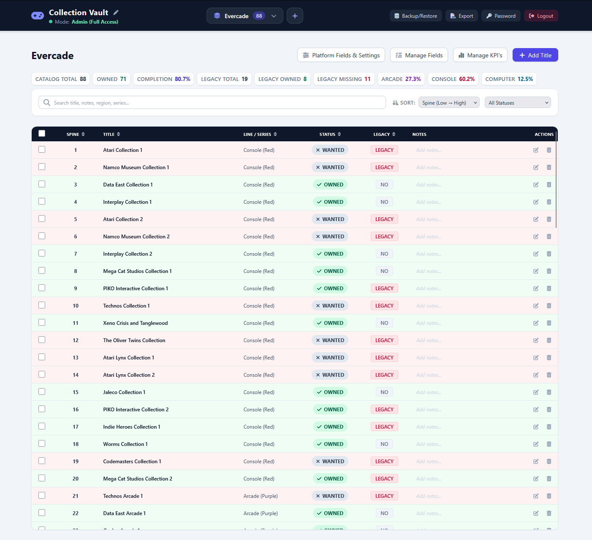

# Collection Vault

A self-hosted collection tracker for retro games, cartridges, vinyl, or
anything else you collect across multiple "platforms" (consoles, series,
formats — whatever grouping makes sense for you). Single admin login, guest
read-only view, and a fully customizable set of fields, KPIs, and columns
per platform.

No build step, no external services, no dependencies beyond PHP itself —
the whole app is plain PHP with an embedded SQLite database.

## Features

- **Platforms** — organize your collection into separate platforms (e.g.
  "NES", "Vinyl", "Evercade"), each with its own fields, columns, sort
  order, and KPIs.
- **Cover Artwork** — upload cover images (game box art, vinyl record
  jackets, etc.) for each entry. View covers in an interactive lightbox popup.
  Choose which field column displays the cover thumbnail button per platform
  (e.g., Album for vinyls, Title or Spine # for games) directly from
  **Manage Fields**.
- **Custom fields** — beyond the built-in fields (Title, Release #,
  Line/Series, Legacy, Status, Packaging, Region, Format, Notes), define
  your own text, number, yes/no, or choice-list fields. Every field —
  built-in or custom — can be renamed, reordered, and enabled/disabled per
  platform from **Manage Fields**.
- **KPI dashboard** — small stat cards (counts, percentages, or "most
  common value") built from your own conditions, fully configurable per
  platform from **Manage KPI's**.
- **Sorting & column order** — click-to-sort with remembered sort levels per
  platform, and a drag-free reorder (via arrows) for both columns and
  fields, saved per platform. Sort order is preserved in-place when uploading
  covers or editing entries.
- **Search & filters** — free-text search plus dropdown filters for any
  yes/no or choice-list field enabled on the platform.
- **Platform templates** — save a field configuration as a reusable
  template when adding new platforms.
- **CSV export** — export any platform's titles to CSV with your choice of
  fields, straight from the toolbar (accessible to both admins and guests).
- **Database backup/restore** — one-click download of the full SQLite
  database, and upload-to-restore (the previous database is always kept
  as a timestamped `.bak` file, never deleted).
- **Factory Reset** — wipe the database and delete all uploaded cover artwork
  to start from scratch, protected with a two-step confirmation (typed keyword
  + warning alert) and automatic safety backup.
- **Admin authentication** — a single admin account (default
  `admin` / `admin123`, forced password change encouraged on first login);
  everyone else gets a read-only guest view of whichever platform they're
  looking at.

## Requirements

- PHP **7.4+** (8.1+ recommended; tested on 8.2 and 8.4) with the
  **`pdo_sqlite`** extension enabled. No other extensions are required
  (`mbstring` is used opportunistically if present, but the app degrades
  gracefully without it).
- A web server that can hand `.php` requests to PHP (nginx + PHP-FPM,
  Apache + mod_php/PHP-FPM, or PHP's own built-in server for quick
  testing).
- Write access for the web server's user to the app's own folder, so it
  can create and update `collection.db` and save images to `uploads/covers/`.
- No MySQL/Postgres, no Composer, no Node — nothing else to install.

## Project structure

```
collection-vault/
├── index.php              # entry point — wires includes and views together
├── .gitignore             # ignores collection.db, backups, and uploaded covers
├── LICENSE                # project license
├── README.md              # documentation and deployment guide
├── collection.db          # created automatically on first run (git-ignored)
├── includes/
│   ├── config.php         # session start + SQLite connection (with auto-recovery)
│   ├── constants.php      # built-in field & KPI definitions, choice colors
│   ├── helpers.php        # helper functions (cover upload/wipe, KPI engine, HTML helpers)
│   ├── schema.php         # CREATE TABLE + migrations — builds the DB from scratch
│   ├── actions.php        # POST action handlers (login, CRUD, AJAX endpoints, exports, wipe)
│   └── render_data.php    # loads platforms, fields, titles & sort data for rendering
├── views/
│   ├── head.php           # HTML <head>, Tailwind CSS & custom styling
│   ├── header.php         # top navbar, platform selector & admin toolbar
│   ├── main.php           # collection data table, quick sort & filter controls
│   ├── modals.php         # modals for titles, platforms, fields, backups & image preview
│   └── scripts.php        # client-side logic, AJAX handlers, sorting & lightbox viewer
├── uploads/
│   └── covers/            # directory for uploaded cover artwork (.gitkeep tracked)
└── screenshots/
    └── admin.png          # UI preview image for README
```

`collection.db` is created the first time the app runs, if it doesn't
already exist — there's no separate install/migration step to run.

## Quick local test (no web server needed)

```bash
cd collection-vault
php -S 127.0.0.1:8000
```

Then open `http://127.0.0.1:8000`.

## Deploying with Docker Compose (nginx + PHP-FPM)

This is the recommended way to run it. Project layout:

```
my-project/
├── docker-compose.yml
├── nginx/
│   └── default.conf
└── www/
    └── collection-vault/     # this repo's contents go here
```

**`docker-compose.yml`**

```yaml
services:
  nginx:
    image: nginx:alpine
    container_name: collection_vault_nginx
    ports:
      - "6337:80"
    volumes:
      - ./www:/var/www
      - ./nginx/default.conf:/etc/nginx/conf.d/default.conf
    depends_on:
      - php
    restart: unless-stopped

  php:
    image: php:8.2-fpm-alpine
    container_name: collection_vault_php
    volumes:
      - ./www:/var/www
    restart: unless-stopped
```

**`nginx/default.conf`**

```nginx
server {
    listen 80;
    server_name _;
    root /var/www/collection-vault;
    index index.php;

    location / {
        try_files $uri $uri/ /index.php?$query_string;
    }

    location ~ \.php$ {
        fastcgi_pass php:9000;
        fastcgi_index index.php;
        fastcgi_param SCRIPT_FILENAME $document_root$fastcgi_script_name;
        include fastcgi_params;
    }

    # Never serve the database or its backups directly
    location ~* \.(db|db-shm|db-wal|bak)$ {
        deny all;
    }

    # index.php is the only entry point — block direct access to internals
    location ~ ^/(includes|views)/ {
        deny all;
    }
}
```

Then:

```bash
docker compose up -d
```

### Bind-mount permissions

Because `./www` is bind-mounted straight from the host, file permissions
are whatever they were on the host filesystem — nothing to configure
inside the container. If you see a `Permission denied` error on
`includes/config.php` (or anything similar) after copying the files in,
fix it on the host:

```bash
chmod -R 755 ./www/collection-vault
find ./www/collection-vault -type f -exec chmod 644 {} \;
chown -R 82:82 ./www/collection-vault
```

The `chown` sets ownership to uid 82, which is `www-data` in the PHP-FPM
Alpine image — that's what lets it **write** `collection.db` into its own
folder, not just read the code. If `chown` isn't available to you (no
root/sudo on the host), `chmod 777 ./www/collection-vault` is the simplest
fallback for local/dev use.

## Deploying on a standalone nginx + PHP-FPM server

1. Copy this repo's contents to somewhere like `/var/www/collection-vault`.
2. Set ownership/permissions for the user PHP-FPM runs as (commonly
   `www-data`):
   ```bash
   chown -R www-data:www-data /var/www/collection-vault
   find /var/www/collection-vault -type d -exec chmod 755 {} \;
   find /var/www/collection-vault -type f -exec chmod 644 {} \;
   ```
3. Add an nginx server block (adjust the `fastcgi_pass` socket/port to
   match your PHP-FPM pool config — check `/etc/php/*/fpm/pool.d/www.conf`
   for `listen = ...`):
   ```nginx
   server {
       listen 80;
       server_name collections.example.com;
       root /var/www/collection-vault;
       index index.php;

       location / {
           try_files $uri $uri/ /index.php?$query_string;
       }

       location ~ \.php$ {
           fastcgi_pass unix:/run/php/php8.2-fpm.sock;
           fastcgi_index index.php;
           fastcgi_param SCRIPT_FILENAME $document_root$fastcgi_script_name;
           include fastcgi_params;
       }

       location ~* \.(db|db-shm|db-wal|bak)$ {
           deny all;
       }

       location ~ ^/(includes|views)/ {
           deny all;
       }
   }
   ```
4. `nginx -t && systemctl reload nginx`.
5. Make sure `pdo_sqlite` is enabled for your PHP-FPM pool
   (`php -m | grep sqlite` on the server, or check
   `phpinfo()`/`php -i` if it's not showing up), then restart PHP-FPM.
6. **On RHEL/CentOS/Fedora/Rocky/AlmaLinux**, check whether SELinux is
   enforcing — if it is, permissions alone (step 2) won't be enough:
   ```bash
   getenforce
   ```
   If that prints `Enforcing`, nginx and PHP-FPM are confined and need the
   app folder labeled correctly before they can read *or* write it, even
   with correct Unix permissions:
   ```bash
   # policycoreutils-python-utils provides semanage, if not already installed
   sudo dnf install -y policycoreutils-python-utils

   # Let nginx/PHP-FPM read the app's PHP files
   sudo semanage fcontext -a -t httpd_sys_content_t "/var/www/collection-vault(/.*)?"

   # Let PHP-FPM write collection.db (and its corrupted-file/import backups)
   sudo semanage fcontext -a -t httpd_sys_rw_content_t "/var/www/collection-vault(/.*)?"

   # Apply the new labels
   sudo restorecon -Rv /var/www/collection-vault
   ```
   If nginx is configured to reach PHP-FPM over TCP (e.g.
   `fastcgi_pass 127.0.0.1:9000;`) rather than a Unix socket, also allow
   that connection:
   ```bash
   sudo setsebool -P httpd_can_network_connect on
   ```
   Still getting permission errors after this? Check what SELinux is
   actually blocking:
   ```bash
   sudo ausearch -m avc -ts recent
   ```

## First login

- Default credentials: **admin / admin123**
- Change the password immediately after your first login (top-right,
  **Password**) — the app flags this as the default password until you do.

## Backups

Use the **Backup/Restore** button (admin only) to download a full copy of
`collection.db` at any time, and to restore from a previously downloaded
copy. Restoring always keeps the database it's replacing as a dated
`.bak` file alongside `collection.db`, so nothing is silently lost.

For automated backups, `collection.db` is a single self-contained SQLite
file — copying it (e.g. via a cron job) is a complete backup on its own.

## Screenshot


